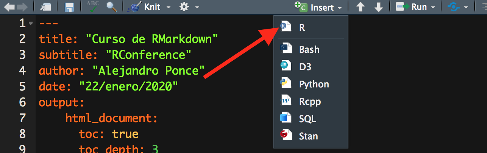
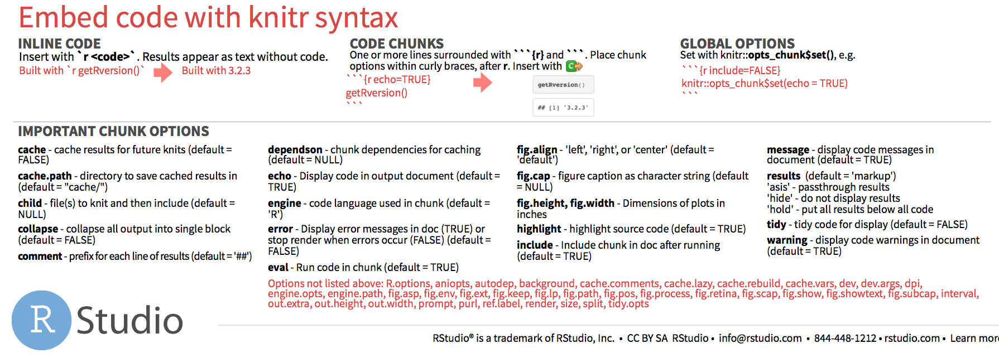
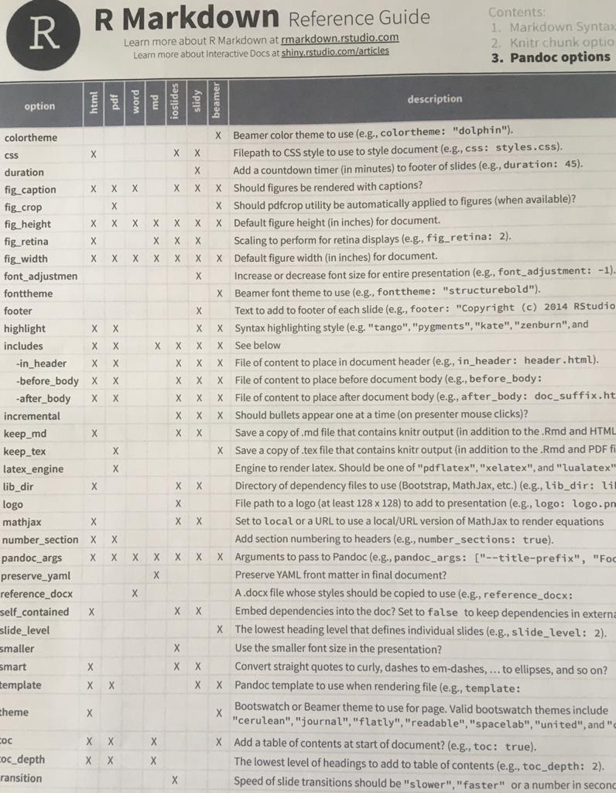

```{r setup, include=FALSE}
knitr::opts_chunk$set(echo = TRUE)
```


# El texto (en Rmarkdown)

Este documento es una modificaicón del curso de **RMarkdown** de Leticia Vega y Alejandro Ponce Mendoza. [Curso RMarkdown](https://github.com/ComunidadBioInfo/minicurso_mar_2021/blob/main/Presentation1.pdf)  
Para una mejor y más completa referencia consulten [RMarkdown: The definitive guide](https://bookdown.org/yihui/rmarkdown/)


La parte del texto suele ser la parte principal de un documento. **En un archivo con extensión Rmd, todo lo que no sea encabezado o código, se interpretará como texto y se mostrará como tal**.

Bajo esta interpretación podríamos terminar aquí la sección de cómo escribir texto en un archivo .Rmd. Sin embargo, **en un texto generalmente queremos darle un cierto formato, es decir, resaltar algunas palabras, ponerlas en cursivas, además de colocar títulos y subtítulos entre otras cosas**. Todo esto lo podremos realizar con Markdown. ***Markdown*** **es un lenguaje de marcado que permite darle formato a un texto** de manera relativamente sencilla.


## Sintaxis de Markdown

### Títulos

Los títulos se producen con un número determinado de veces el símbolo **#**, antes del texto correspondiente al nivel de título deseado (en HTML se pueden tener hasta 6 niveles). Por ejemplo:

\# Esto es un título de nivel 1

# Esto es un título de nivel 1 {-}

\## Esto es un título de nivel 2

##Esto es un título de nivel 2 {-}
 
 
 <h5>Esto es un encabezado nivel 5 escrito en html</h5>
\###### Esto es un título de nivel 6

###### Esto es un título de nivel 6 {-}

### Párrafos

Para crear párrafos, se deja una línea en blanco entre cada párrafo, por ejemplo:

Este es el primer párrafo

Este es el segundo párrafo

Por otra parte, para crear un salto de línea dentro de un párrafo, simplemente se dejan dos espacios al final de la última palabra de esa línea, de este modo:

Esta es la primera línea  
y este es el salto de línea.
 
### Formato del texto

Algunos formatos básicos de texto son: **bold**, *cursiva*, ~~tachado~~ y la combinación de estos. Por ejemplo:

```**Esto es bold**``` se verá: **Esto es bold**  
```*Esto es cursiva*``` se verá: *Esto es cursiva*  
```~~Esto es tachado~~``` se verá ~~Esto es tachado~~  
```***Esto es cursiva bold***``` se verá ***Esto es cursiva bold***  
```~~*Esto es cursiva tachado*~~``` se verá ~~*Esto es cursiva tachado*~~

En el caso del asterisco (*), éste se puede cambiar por guión bajo (_), por ejemplo:

```__Esto es bold__``` se verá __Esto es bold__

También podemos poner subíndices y superíndices, utilizando los símbolos (~) y (^), respectivamente, Por ejemplo:

```Subíndiice F~2~``` se verá Subíncice F~2~  
```Superíndice F^2^``` se verá Superíndice F^2^

### Listas

En Markdown se pueden crear dos tipos de listas, ordenadas y no ordenadas. Veamos cómo crear estos dos tipos de listas con algunos ejemplos:

Así definimos una lista ordenada

```
1. Primer componente de la lista
2. Primer componente de la lista
3. Primer componente de la lista
```

1. Primer componente de la lista
2. Primer componente de la lista
3. Primer componente de la lista
    
> Para que una lista sea ordenada debe iniciar con un número, no importa el orden o si el número se repite. Al momento de visualizar el resultado se mostrará de manera creciente iniciando con el número uno y sin repeticiones.

Para las listas no ordenadas utilizamos cualquiera de los símbolos *, +, -. Por ejemplo:

Así definimos una lista no ordenada

```
* Un elemento de la lista
+ El siguiente elemento de la lista
* Otro elemento de la lista
```

* Un elemento de la lista
* El siguiente elemento de la lista
* Otro elemento de la lista

> Los símbolos se pueden utilizar combinados o de un único estilo, el efecto será el mismo.

Además, se pueden mezclar distintos tipos de listas y anidar unas dentro de otras, por ejemplo:

Así definimos una lista no mezclada (ordenada y no oredenada)

```
1. Esto es una lista ordenada
2. 2do elemento de la lista ordenada
    1. Lista ordenada anidada dentro de otra
        * Lista no ordenada anidada a 3er nivel
        * 2do elemento de esta lista
    2. 2do elemento de la lista ordenada anidada
```
1. Esto es una lista ordenada
2. 2do elemento de la lista ordenada
    1. Lista ordenada anidada dentro de otra
        * Lista no ordenada anidada a 3er nivel
        * 2do elemento de esta lista
    2. 2do elemento de la lista ordenada anidada


### Insertar hipervínculos e imágenes

**`Existen dos formas de insertar hipervínculos`** o enlaces. La primera está asociada a una palabra o frase, de tal forma que al momento de pasar el cursor por la palabra se visualizará el hipervínculo o al dar click en la palabra nos direccionará a la página asociada al hypervínculo. Por ejemplo: 

```
[RMarkdown](https://rmarkdown.rstudio.com/index.html) es un paquete de RStudio ...
```

El resultado será:

[RMarkdown](https://rmarkdown.rstudio.com/index.html "Este es el título") es un paquete de RStudio ...

La segunda forma es citar el hipervínculo explícitamente, de tal manera que se puede visualizar en el texto y al momento de dar clic en el hipervínculo nos direccionará a la página asociada a él. Simplemente: **`encerramos entre los caracteres menor < que y mayor que > la URL`**, por ejemplo:

```
Para consultar la información de RMardown puedes ir al sitio <https://rmarkdown.rstudio.com/index.html>
```

El resultado será:

Para consultar la información de RMardown puedes ir al sitio <https://rmarkdown.rstudio.com/index.html>

**`La manera de insertar imágenes es muy similar a la de creación de hipervínculos`**, con una única diferencia, se añade el carácter exclamación **!** al principio de la pareja de corchetes que definen el nombre del enlace. Por ejemplo:

```
 ](https://ichef.bbci.co.uk/news/800/cpsprodpb/166EA/production/_100128819_gettyimages-531256760.jpg.jpg)
```

 ](https://ichef.bbci.co.uk/news/800/cpsprodpb/166EA/production/_100128819_gettyimages-531256760.jpg)


Con los parámetros **width** y **height** podemos controlar el tamaño de la image en porcentaje. Por ejemplo:

```
 ](https://ichef.bbci.co.uk/news/800/cpsprodpb/166EA/production/_100128819_gettyimages-531256760.jpg.jpg){width=50% height=50%}
```

 ](https://ichef.bbci.co.uk/news/800/cpsprodpb/166EA/production/_100128819_gettyimages-531256760.jpg){width=50% height=50%}


### Insertar vídeos de fuentes en línea

En este caso usaremos la notación de html

```
<div>
<p style = 'text-align:center;'>
<iframe width="600" height = "420"
src="https://www.youtube.com/embed/tgbNymZ7vqY">
</iframe>
</div>
</p>
```


```{r}
library("vembedr")
embed_url("https://www.youtube.com/embed/tgbNymZ7vqY")
```


<div>
<p style = 'text-align:center;'>
<iframe width="600" height = "420"
src="https://www.youtube.com/embed/tgbNymZ7vqY">
</iframe>
</div>
</p>


<div>
<iframe width="560" height="315" src="https://www.youtube.com/embed/zNzZ1PfUDNk" title="YouTube video player" frameborder="0" allow="accelerometer; autoplay; clipboard-write; encrypted-media; gyroscope; picture-in-picture" allowfullscreen></iframe>
<div>

# Ecuaciones

Para agregar ecuaciones al documento se utiliza la misma sintaxis que en $\LaTeX$, por medio del símbolo $ o $$. Si la ecuación se encuentra entre un par de $, entonces la ecuación se escribe en línea, por ejemplo:

```
Las ecuaciones diferenciales que definen el modelo de presas y depredadores conocido como Lotka-Volterra son $\dot x = ax -bxy$ y $\dot y = -cy +dxy$. En este caso las ecuaciones quedarán en la misma línea que el texto.
```

Lo anterior se verá como:

Las ecuaciones diferenciales que definen el modelo de presas y depredadores conocido como Lotka-Volterra son $\dot x = ax -bxy$ y $\dot y = -cy +dxy$. En este caso las ecuaciones quedarán en la misma línea que el texto.
 
 
Por otra parte, si la fórmula se pone en medio de dos pares de $, entonces ésta se escribirá al centro de una línea. Por ejemplo:

```
Las ecuaciones diferenciales que definen el modelo de presas y depredadores conocido como Lotka-Volterra son $$\dot x = ax -bxy$$ y $$\dot y = -cy +dxy$$. En este caso las ecuaciones quedarán en la misma línea que el texto.
```

 Las ecuaciones diferenciales que definen el modelo de presas y depredadores conocido como Lotka-Volterra son $$\dot x = ax -bxy$$ y $$\dot y = -cy +dxy$$. En este caso las ecuaciones quedarán en una distinta línea que el texto.

## Gráficos interactivos en RMarkdown

Podemos usar la librería de `plotly` para tener gráficos interactivos en la salida de html


```{r message=TRUE, warning=FALSE}
library(plotly)
```


Con esta librería podemos a partir de cualquier objecto tipo **ggplot** en **plotly**, es decir en interactivo


Por ejemplo si usamos una de las bases de datos pre cargadas en R (`mpg`) tenemos


```{r message=FALSE, warning=FALSE}
ggplot(data = mpg, mapping = aes(x = displ, y = hwy)) + 
  geom_point(mapping = aes(color = class)) + 
  geom_smooth(data = filter(mpg, class == "subcompact"), se = FALSE)
```


  Pero podemos asignarla a una variable y luego convertirla en interactiva con la función `ggplotly()`
  
  
```{r}
p<-ggplot(data = mpg, mapping = aes(x = displ, y = hwy)) + 
  geom_point(mapping = aes(color = class)) + 
  geom_smooth(data = filter(mpg, class == "subcompact"), se = FALSE)

ggplotly(p)
```


```{r}
library(palmerpenguins)
library(tidyverse)
data('palmerpenguins')

mass_flipper <- ggplot(data = penguins, 
                       aes(x = flipper_length_mm,
                           y = body_mass_g)) +
  geom_point(aes(color = species, 
                 shape = species),
             size = 3,
             alpha = 0.8) +
  scale_color_manual(values = c("darkorange","purple","cyan4")) +
  labs(title = "Penguin size, Palmer Station LTER",
       subtitle = "Flipper length and body mass for Adelie, Chinstrap and Gentoo Penguins",
       x = "Flipper length (mm)",
       y = "Body mass (g)",
       color = "Penguin species",
       shape = "Penguin species") +
  theme(legend.position = c(0.2, 0.7),
        plot.title.position = "plot",
        plot.caption = element_text(hjust = 0, face= "italic"),
        plot.caption.position = "plot")

mass_flipper

```
En su versión interactiva

```{r}
ggplotly(mass_flipper)
```

## Tablas interactivas   


Podemos utilizar la librería `DT` para generar tablas interactivas

```{r}
library(tidyverse)
tabla<-penguins %>% 
  group_by(species) %>% 
  summarize(across(where(is.numeric), mean, na.rm = TRUE))
```


```{r}
library(DT)
datatable(tabla)
```

```{r}
library(networkD3) # Generar redes con D3

# Guardamos bases de ejemplo 
MisLinks <- networkD3::MisLinks
MisNodes <- networkD3::MisNodes 

# Exploramos datos 
head(MisLinks)

# Realizar la visualización.
forceNetwork(Links = MisLinks, 
             Nodes = MisNodes,
             Source = "source", 
             Target = "target", 
             Value = "value", 
             NodeID = "name", 
             Nodesize = "size",
             Group = "group", 
             opacity = 0.8,
             width = 600, 
             height = 600, 
             fontSize = 15)
```

 ## Como ligar `igraph` con `network3D`
 
```{r}
# Load igraph
library(igraph)

# Use igraph to make the graph and find membership
karate <- make_graph("Zachary")
wc <- cluster_walktrap(karate)
members <- membership(wc)

# Convert to object suitable for networkD3
karate_d3 <- igraph_to_networkD3(karate, group = members)

# Create force directed network plot
forceNetwork(Links = karate_d3$links, Nodes = karate_d3$nodes, 
             Source = 'source', Target = 'target', 
             NodeID = 'name', Group = 'group')
```

### Combinar dos gráficas con un control

#### No correr si no tienen o quieren instalar estas librerías


```{r eval=FALSE, message=FALSE, warning=FALSE, include=FALSE}
library(tidyverse)
library(sf)
library(mapview)
library(GADMTools)
library(ggspatial)
library(leaflet)
library(leaflet.extras2)
library(spdep)
library(spatstat)  
library(raster)
library(smacpod)
library(ggspatial)
```


```{r eval=FALSE, include=FALSE}
covid <- read_csv(url("https://zenodo.org/record/4915889/files/covid19data.csv?download=1"))
covid_p <- covid %>%
  st_as_sf(coords = c("lon", "lat"), crs = 4326)
covid_p %>%
  filter(FECHA_RESULTADO == "2020-12-11") %>%
  ggplot() +
  geom_sf() 

```


```{r eval=FALSE, include=FALSE}
m_p <- covid_p %>% 
  filter(FECHA_RESULTADO == "2020-12-10") %>%
  mapview(layer.name = "puntos")

m_p
```


```{r eval=FALSE, include=FALSE}
peru <- gadm_sf_loadCountries("PER", level=3)
lima_sf <- peru %>%
  pluck("sf") %>%
  # Filtramos los datos espaciales solo de Lima metropolitana
  filter(NAME_2 == "Lima") %>%
  # Editamos algunos errores en nuestros datos espaciales
  mutate(NAME_3 = ifelse(NAME_3 == "Magdalena Vieja",
                         "Pueblo Libre", NAME_3))
```


```{r eval=FALSE, include=FALSE}
covid_count <- covid %>%
  group_by(DISTRITO, FECHA_RESULTADO) %>%
  summarise(casos = n()) %>%
  ungroup() %>%
  complete(FECHA_RESULTADO = seq.Date(min(FECHA_RESULTADO, na.rm =T),
                                      max(FECHA_RESULTADO, na.rm = T),
                                      by="day"),
           nesting(DISTRITO), fill = list(n = 0))

covid_sf <- lima_sf %>%
  mutate(DISTRITO = toupper(NAME_3)) %>%
  full_join(covid_count, by = "DISTRITO", "FECHA_RESULTADO")
```


```{r eval=FALSE, include=FALSE}
covid_sf %>%
  filter(FECHA_RESULTADO == "2020-12-11") %>%
  ggplot() +
  geom_sf()
```


```{r, eval=FALSE}
m_sf <- covid_sf %>% 
  filter(FECHA_RESULTADO == "2020-12-11") %>%
  mapview(layer.name = "distritos")

m_sf
```


```{r eval=FALSE, include=FALSE}
m1 <- covid_p %>%
  filter(FECHA_RESULTADO == "2020-04-11") %>%
  mapview(zcol = "SEXO", layer.name = "2020-04-11 - SEXO")

m2 <- covid_p %>%
  filter(FECHA_RESULTADO == "2020-12-11") %>%
  mapview(zcol = "SEXO", layer.name = "2020-12-11 - SEXO")


m1 | m2
```


## Apéndice de temas extras


### Citas bibiliográficas en RMarkdown

En RMarkdown podemos hacer citas con el formato de $\LaTeX$

Para ello necesitamos:

1. Un archivo de texto que contenga las referencias que vamos a citar en formato $\TeX$, es decir un archivo de texto de la siguiente forma:

```
@book{xie2018r,
  title={R markdown: The definitive guide},
  author={Xie, Yihui and Allaire, Joseph J and Grolemund, Garrett},
  year={2018},
  publisher={Chapman and Hall/CRC}
}

@book{mclean2007theoretical,
  title={Theoretical ecology: principles and applications},
  author={McLean, Robert McCredie May Angela R and others},
  year={2007},
  publisher={Oxford University Press on Demand}
}

@book{hastings2012encyclopedia,
  title={Encyclopedia of theoretical ecology},
  author={Hastings, Alan and Gross, Louis},
  number={4},
  year={2012},
  publisher={Univ of California Press}
}
@article{Dakos2015, author = {Dakos, Vasilis and Scheffer, Marten and 
Carpenter, Stephen R and Dakos, Vasilis and Nes, Egbert Van}, doi = 
{10.1146/annurev-ecolsys-112414-054242}, file = 
{:Users/robertoalvarez/Library/Application Support/Mendeley 
Desktop/Downloaded/Dakos et al. - 2015 - Generic Indicators of 
Ecological Resilience Inferring the Chance of a Critical Transition 
Generic Indicators of E.pdf:pdf}, mendeley-groups = 
{Criticalidad,Early Warning}, number = {November}, title = {{Generic 
Indicators of Ecological Resilience : Inferring the Chance of a 
Critical Transition Generic Indicators of Ecological Resilience : 
Inferring the Chance of a Critical Transition}}, year = {2015}
}
```

Usualamente dicho archivo, de texto, tiene extensión `.bib`


A partir de eso podemos citar en cualquier parte del texto con las etiquetas que provee el documento con extensión *.bib*. Es decir ``@ + etiqueta`


Voy a citar por ejemplos los libros  @hastings2012encyclopedia; @mclean2007theoretical
Además el paper @Dakos2015

Se puede cambiar la forma de citar con los estilos d csl

Por ejemplo, si queremos citar estilo **Nature**
descragamos el estilo y lo modificamos en el YAML

```{r}
download.file("https://www.zotero.org/styles/nature?source=1", destfile = "nature.csl")
```

Otro sitio para descargar los archivos extensión *csl* están en el siguiente repositorio:

[Github con csl](https://github.com/citation-style-language/styles)

### Notas de pie de página

Para agregar una nota al pie de página se pone entre corchetes el número de la nta de pie precedido de el símbolo ^, por ejemplo:

```
Esto es un texto con nota al pie [^1], por lo tanto debe aparecer abajo de la hoja.

[^1]: Aquí va el texto que aparecerá en la nota al pie de página.
```

Debe aparecer así:

Esto es un texto con nota al pie [^1], por lo tanto debe aparecer abajo de la hoja.

[^1]: Aquí va el texto que aparecerá en la nota al pie de página.

### ¿Cómo colocar una liga a un título del mismo documento?

Para insertar un enlace hacia un título dentro del mismo texto, ponemos en corchetes el título o subtítulo hacia donde queremos generar la liga. Por ejemplo, 

```
Esta forma de insertar enlaces es similar a la que vimos en la sección [Insertar hipervínculos e imágenes]
```

Se verá:

Esta forma de insertar enlaces es similar a la que vimos en la sección [Insertar hipervínculos e imágenes]


### Insertar tablas desde Markdown

Para crear tablas debemos indicar cuáles son los elementos de la cabecera y separar los campos con el símbolo "**|**" (pipe). Por ejemplo,

```
Columna 1 | Columna 2
-- | --
1 | 34
24| 16
```

Se verá:

Columna 1 | Columna 2
-- | --
1 | 34
24| 16

Si se desea, por estética, se pueden alinear las columnas e incluso comenzar y finalizar las filas con el símbolo |, pero no es en absoluto necesario. Por ejemplo:

```
| Columna 1 | Columna 2 |
| --------- | --------- |
|     1     |     34    |
|     24    |     16    |
```

Se verá así:

| Columna 1 | Columna 2 |
| --------- | --------- |
|     1     |     34    |
|     24    |     16    |

Se puede especificar la alineación de cada columna mediante la adición de dos puntos a las líneas de separación. Por ejemplo:

```
Elemento | Cantidad | Precio 
:------- | :------: | -----: 
Prod 1   | 15       | $150  
Prod 2   | 3250     | $23,65
```

Elemento | Cantidad | Precio 
:------- | :------: | -----: 
Prod 1   | 15       | $150   
Prod 2   | 3250     | $23,65 

En este caso, dos puntos a la izquierda de la línea de separación hará que la columna esté alineada a la izquierda, dos puntos a la derecha de la línea hará que la columna esté alineada a la derecha, dos puntos en ambos lados significa que la columna se alinea al centro.

### kable() y kableExtra

Existe otra forma de crear tablas, con una amplia posibilidad de cambiar la estética de las mismas. Para ello se utiliza la función kable que viene en el paquete knitr y el paquete `kableExtra` y `flextable` que se verán más adelante en esta guía. También puedes encontrar información en las siguientes ligas:

**Para `kableExtra`:**  
https://bookdown.org/yihui/rmarkdown-cookbook/kable.html
https://cran.r-project.org/web/packages/kableExtra/vignettes/awesome_table_in_html.html  
**Para `flextable`:**  
https://davidgohel.github.io/flextable/reference/index.html#section-create-flextable


# Adición de código de `R` en `RMarkdown`

El código normalmente se adiciona con la selección de una opción en la parte superior:

```{r, include=FALSE}
options(tinytex.verbose = TRUE)
```

```{r, out.width='70%', fig.align='center'}

```

y abrirá un espacio entre llaves de la siguiente forma:  

<pre>
#```{r}

#```
</pre>

En este espacio ya se puede adicionar el código que nosotros queramos de `R` o de otro programa como **Python**, **SQL**. Por ejemplo para **python** se vería con el mismo formato:  

<pre>
#```{python}

#```
</pre>

En la Cheat Sheet de rmarkdown esta la sección de **Embed code with knitr syntax**. 

```{r, out.width='100%', fig.align='center', echo=FALSE}


```


Esta sección nos permitire ajustar las características del código que se escriba como lo veremos a continuación:

## Chunk option: **echo**  
Esta opción nos permite incluir el código dentro del texto. Por ejemplo:


<pre>
#```{r echo=TRUE}
#
#library(tidyverse)
#
#```
</pre>

```{r echo=TRUE, warning=FALSE, message=FALSE}

library(tidyverse)

```

## Chunk option: **warning** y **message**

En ocasiones por las versiones de los paquetes manda advertencias (warnings) y mensajes (message) en `R`. estos se pueden controlar  con la opción `warning=FALSE`

```{r echo=TRUE, warning=FALSE}

library(tidyverse)

```
De esta forma solo sale el código sin más warnings

Es la misma opción para los **message**: `message=FALSE` y quedarán escondidos estos mensajes para el documento del `RMarkdown`.

<pre>
#```{r echo=TRUE, warning=FALSE, message=FALSE}
#
#library(tidyverse)
#
#```
</pre>

Finalmente, si no queremos que salga absolutamente nada del código se coloca la siguiente opción `echo=FALSE` de la siguiente forma:

<pre>
#```{r echo=FALSE, warning=FALSE, message=FALSE}
#
#library(tidyverse)
#
#```
</pre>


## Insertar una figura y modificar sus dimensiones con **out.width** y su alineación con **fig.align**  

Esto se puede hacer con la opción `knitr::include_graphics`. y los parámetros que se incluirán serán los siguientes:`{r,  echo=FALSE, out.width='35%', fig.align='center'}`. La opción `out.width=` es en porcentaje y para la alineación `fig.align=` son las opciones **left, center y right** para **izquierda, centro y derecha** respectivamente. para controlar el tamaño dela figura y también la posición. Usaremos la misma imagen que se utilizó de la BBC

<pre>
#```{r, echo=FALSE, out.width='35%', fig.align='center'}
#
#url1 <- c("https://ichef.bbci.co.uk/news/800/cpsprodpb/166EA/production/_100128819_gettyimages-53125#6760.jpg")
#
#knitr::include_graphics(url1)
#```
</pre>


```{r, echo=FALSE, out.width='35%', fig.align='center'}

#url1 <- c("https://ichef.bbci.co.uk/news/800/cpsprodpb/166EA/production/_100128819_gettyimages-53125#6760.jpg")

#
```

## Insertar una gráfica y modificar sus dimensiones con **out.width** y su alineación con **fig.align** 
Las figuras son muy semejantes a las imágenes. Por ejemplo con la siguiente figura con la base de datos `iris`con las siguientes características del `chunk`: **{r, echo=TRUE, out.width='50%', fig.align='center'}**  

```{r, echo=TRUE, out.width='50%', fig.align='center'}
library(ggthemes)
data(iris)
plot1 <- ggplot(aes(x = Species, y = Sepal.Length),
                data = iris) +
  geom_boxplot() +
  geom_jitter(aes(colour = Species), size = 3, alpha = 0.3) +
  theme_minimal()
  
plot1

```

## Insertar una tabla con la opción **results**  

Ya previamente se vió como se puede hacer una tabla escribiendo el código (ver sección: **1.2.3 Insertar tablas desde Markdown**) directamente en el texto. Ahora se harán las tablas con la función `kable` del paquete `knitr`. Escribamos directamente lo siguiente con las siguientes opciones: **{r results='asis', echo=TRUE}**  

```{r results='asis', echo=TRUE}

iris1 <- head(iris)
knitr::kable(iris1, caption = "Tabla con kable")

```
La función `results=` tiene tres opciones `asis`, `hold` y `hide`; las dos primeras dan casi el mismo resultado, se puede jugar con estas opciones para ver las diferencias. En caso de que se quiera ocultar el resultado se puede seleccionar la opción `hide`.  

## Insertar una tabla con los paquetes `flextable`  

El paquete [flextable](https://davidgohel.github.io/flextable/reference/index.html#section-borders) permite muchas opciones para mejorar la presentación final de la tabla.  Con la misma tabla pero con este paquete:  

```{r echo=FALSE, warning=FALSE, message=FALSE}
library(flextable) 
```

```{r results='asis', echo=TRUE}

iris2 <- iris1 %>% 
  flextable()

iris2
```

Esta sería la forma más básica de la tabla. Ahora vamos a agregar algunas caracaterísticas que se irán explicando dentro del código:  


```{r results='asis', echo=TRUE, warning=FALSE}

iris2 <- iris1 %>%
  flextable() %>%  # Para convertir en un documento del tipo flextable
  autofit() %>%  # auto ajustar
  fix_border_issues(part = "all") %>%
  bold(part = "header") %>% # poner en negritas
  align(align = "center", part = "all") # para alinear

iris2
```
Con este paquete se puede resaltar alguna parte en particular de la tabla, por ejemplo:  


```{r results='asis', echo=TRUE, warning=FALSE}

iris2 <- iris1 %>%
  flextable() %>%  # Para convertir en un documento del tipo flextable
  autofit() %>%  # auto ajustar
  fix_border_issues(part = "all") %>%
  bold(part = "header") %>% # poner en negritas
  align(align = "center", part = "all") %>%  # para alinear
  color(., ~ Sepal.Width > 3.5, ~ Sepal.Width, color = "red") %>%
  color(., ~ Sepal.Length > 5, ~ Sepal.Length, color = "#2ca25f")

iris2
```

Finalmente cambiemos el color del fondo del encabezado


```{r results='asis', echo=TRUE, warning=FALSE}

iris2 <- iris1 %>%
  flextable() %>%  # Para convertir en un documento del tipo flextable
  autofit() %>%  # auto ajustar
  fix_border_issues(part = "all") %>%
  bold(part = "header") %>% # poner en negritas
  align(align = "center", part = "all") %>%  # para alinear
  color(., ~ Sepal.Width > 3.5, ~ Sepal.Width, color = "red") %>%
  color(., ~ Sepal.Length > 5, ~ Sepal.Length, color = "#2ca25f") %>% 
  bg(., bg = "#fed976", part = "header")

iris2
```


El paquete [flextable](https://ardata-fr.github.io/flextable-book/index.html) esta muy bien documentado y fácil de seguir para poder arreglar la gráfica como uno lo desee.

Finalmente para poder hacer un documento PDF. con el paquete [`tinytex`](https://yihui.org/tinytex/) te lleva paso a paso para lograrlo.

# Estructura del YAML  

Al momento de elaborar un documento tipo `R Markdown` se cre un `YAML` básico. Este contiene los siguientes elementos:  **título**, **autor**, **fecha** y **output**. Los primeros tres elementos estan entre comillas ("") y se pueden modificar sin ninguna restricción. El último elemento, el `output`, esta escrito en formato de *snake_case*.

<pre>
___
title: "Curso de RMarkdown"
author: "UAQ"
date: "14 de Mayo de 2021"
output: html_document
___
</pre>

Existen varias opciones para la opción `output`:  

1. html_document
2. pdf_document
3. word_document
4. odt_document
5. rtf_document
6. md_document
7. github_document
8. ioslides_presentation
9. slidy_presentation
10. beamer_presentation  

Para este curso nos quedaremos con la opción **html_document**.  

Vamos a empezar a agregar distintos componentes. nos podemos guiar de la lista de opciones que tienen para cada formato:

```{r fig.align='center', fig.show='hold', include=FALSE, out.width='75%', results="asis"}

```


## Agregar un subtítulo  
Además de la opción `title` esta la opción `subtitle`. Pongamos en nuestro ejemplo lo siguiente:  

<pre>
___
title: "Curso de RMarkdown"
subtitle: "RConference"
author: "UAQ"
date: "14 de Mayo de 2020"
output: html_document
___
</pre>  

## Agregar una Tabla de contenidos con la opción `toc`  
para agregar la tabla de contenidos o índice se tiene que agregar la opción `toc: true` dentro del `html_document`:

<pre>
___
title: "Curso de RMarkdown"
subtitle: "RConference"
author: "Roberto Álvarez"
date: "14 de Mayo de 2021"
output: 
    html_document:
      toc: true
___
</pre>

Además la tabla de contenidos tienen otras opciones que nos van ayudar a que sea reactivo nuestro índice. Estan las opciones `toc_depth` y `toc_float`. `toc_depth`, nos va a permitir incluir en el índice los headers; si seleccionamos `toc_depth: 3` significa que se incluirán headers con: #, ## y ###. Por su parte `toc_float`, nos permite colocar el índice de forma flotante del lado izquierdo (`toc_float:true`). Agreguemos estas opciones a nuestro `YAML`:

<pre>
___
title: "Curso de RMarkdown"
subtitle: "RConference"
author: "Roberto Álvarez"
date: "14 de Mayo de 2021"
output: 
    html_document:
      toc: true
      toc_depth: 3
      toc_float: true
___ 
</pre>

La opción `toc_float` tiene dos opciones: `collapse` y `smooth_scroll`, ambas son `true` por de fault, es decir que el índice estará colapsado y se irá abriendo conforme uno se vaya moviendo en el documento y al moverse en el documento se hará de forma suave. Desactivemos estas opciones. Quedaría de la siguiente forma:  

<pre>

</pre>

### Agregar número a cada sección con la opción  `number_section`  
Para numerar automáticamente cada una de las secciones sólamente se escoge la opción: `number_section: true`.  

<pre>
---
title: "Curso de RMarkdown"
subtitle: "RConference"
author: "Roberto Álvarez"
date: "14 de Mayo de 2021"
output: 
    html_document:
      toc: true
      toc_depth: 3
      toc_float: true
      number_section: true
---
</pre>

### Agregar un `theme`  
En la opción `theme` se tienen los básicos incluidos como: `"cerulean"`, `"journal"`, `"flatly"`, `"darkly"`, `"readable"`, `"spacelab"`, `"united"`, `"cosmo"`, `"lumen"`, `"paper"`, `"sandstone"`, `"simplex"`, `"yeti"`. Prueben varias opciones y vean los cambios que se presentan. El `YAML` quedaría de la siguiente forma:

<pre>
---
title: "Curso de RMarkdown"
subtitle: "RConference"
author: "Roberto Álvarez"
date: "22/enero/2020"
output: 
    html_document:
      toc: true
      toc_depth: 3
      toc_float:
         collapsed: false
         smooth_scroll: false
      number_section: true
      theme: "cosmo"
---

</pre>

*Ejercicio*: 2 minutos para jugar con estas opciones. Seleccionen la que les guste más.  

### Agregar un `highlight`  
Al igual que la opción anterior se tienen varios `highlight`para escoger: `"tango"`, `"pygments"`, `"kate"` y `"zenburn"`.

### Tamaño de las figuras con la opción `fig_width` y `fig_height`  
La configuración de las figuras se puede hacer en cada *chunk* que se añada o se puede estandarizar desde el `YAML`, ejemlo: 

<pre>
output:  
html_document:  
fig_width: 6  
fig_height: 3  
</pre>

los valores de la gráfica están en pulgadas. Aunque el control de cada gráfica se puede hacer dentro del `chunck` y nos permite tener más flexibilidd para el diseño de cada gráfica de forma independiente. Por el momento no agregaremos la opción del tamaño de las figuras.  

Nuestro `YAML` al final queda de la siguiente forma:  

<pre>

title: "Insertar Texto y  estilo al mismo con R Markdown"
author: "Roberto Álvarez"
date: "12/3/2021"
output: 
    html_document:
      toc: true
      toc_depth: 3
      toc_float:
         collapsed: false
         smooth_scroll: true
      number_section: true
      theme: "flatly"
      
</pre>

Algunos sitio donde pueden conocer más sobre las opciones del RMarkdown:  
## Bibliografía  
+ https://monashbioinformaticsplatform.github.io/2017-11-16-open-science-training/topics/rmarkdown.html 

+ https://bookdown.org/yihui/rmarkdown/html-document.html 


Este `RMarkdown` fue hecho con las siguientes versiones de `R` y  `paquetes`: 

```{r echo=TRUE}

sessionInfo()

```

# Bibilografía

