# Tema preestablecido

Cuando usamos Rmarkdown y creamos el archivo .html, este tendrá un tema preestablecido.

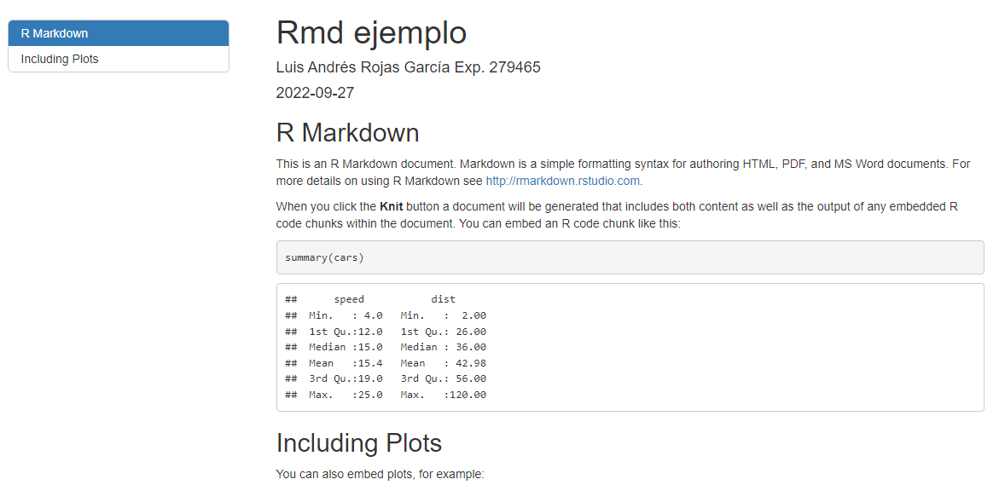
<br>
<br>

# Temas preliminares

Sin embargo, podemos ir cambiando la visualización del tema en el archivo .html.
<br>
<br>
Esto lo podemos hacer al establecer el tema en el material preliminar YAML. 

```
---
title: "Rmd ejemplo"
author: "Luis Andrés Rojas García Exp. 279465"
date: "2022-09-27"
output: html_document
---

```
<br>
<br>
En esta parte, debemos seleccionar el tema del paquete predeterminado que deseemos. Estos inclyen a: 

## cerulean

```
---
title: "Rmd ejemplo"
author: "Luis Andrés Rojas García Exp. 279465"
date: "2022-09-27"
output:
  html_document:
    theme: cerulean
    toc: yes
    toc_float:
      collapsed: no
      smooth_scroll: yes
---
```

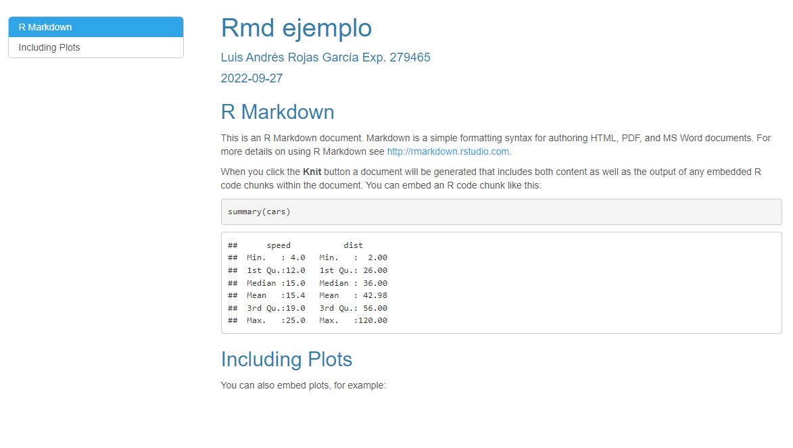
<br>
<br>

## cosmo

```
---
title: "Rmd ejemplo"
author: "Luis Andrés Rojas García Exp. 279465"
date: "2022-09-27"
output:
  html_document:
    theme: cosmo
    toc: yes
    toc_float:
      collapsed: no
      smooth_scroll: yes
---
```

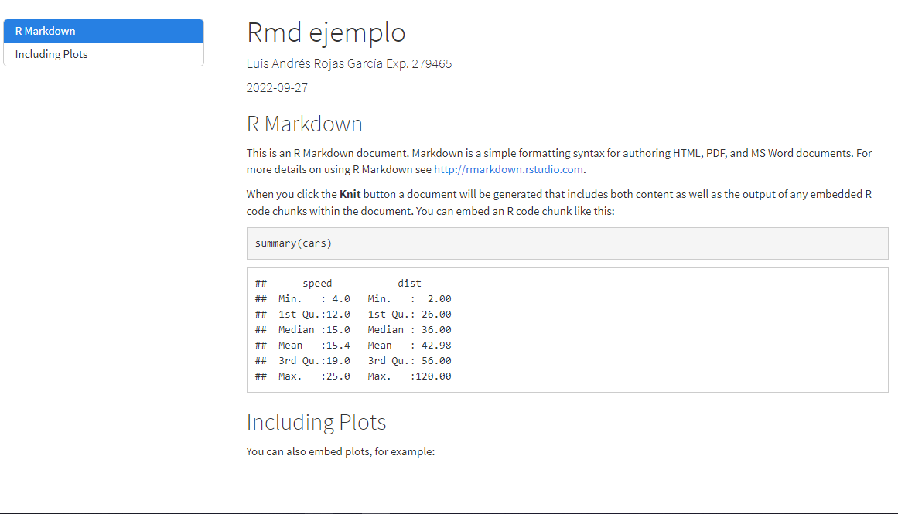
<br>
<br>

## flatly

```
---
title: "Rmd ejemplo"
author: "Luis Andrés Rojas García Exp. 279465"
date: "2022-09-27"
output:
  html_document:
    theme: flatly
    toc: yes
    toc_float:
      collapsed: no
      smooth_scroll: yes
---
```

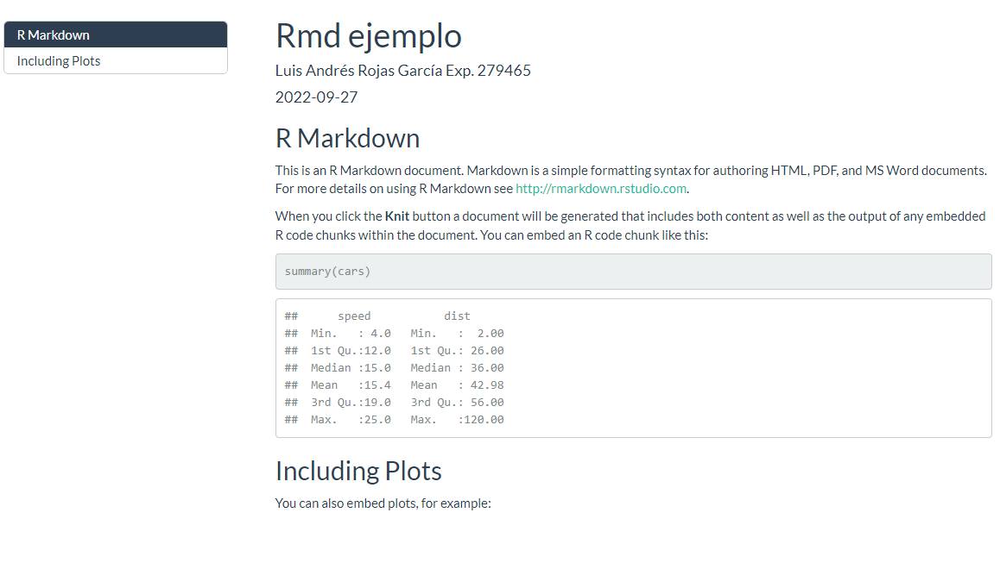
<br>
<br>

## journal

```
---
title: "Rmd ejemplo"
author: "Luis Andrés Rojas García Exp. 279465"
date: "2022-09-27"
output:
  html_document:
    theme: journal
    toc: yes
    toc_float:
      collapsed: no
      smooth_scroll: yes
---
```

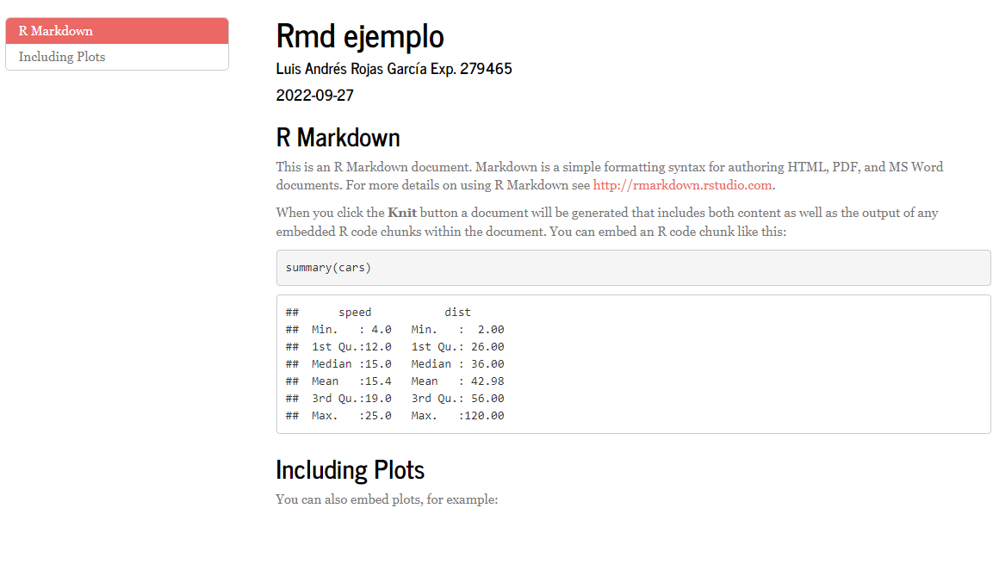
<br>
<br>

## lumen

```
---
title: "Rmd ejemplo"
author: "Luis Andrés Rojas García Exp. 279465"
date: "2022-09-27"
output:
  html_document:
    theme: lumen
    toc: yes
    toc_float:
      collapsed: no
      smooth_scroll: yes
---
```

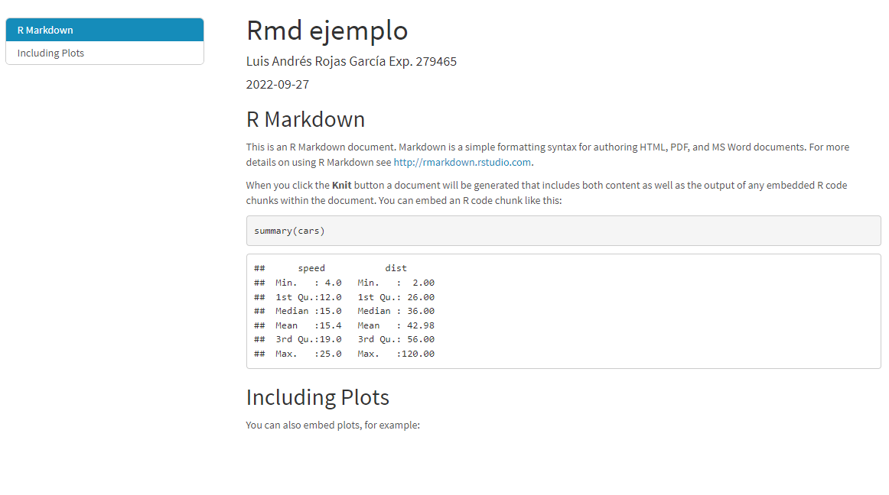
<br>
<br>

## paper

```
---
title: "Rmd ejemplo"
author: "Luis Andrés Rojas García Exp. 279465"
date: "2022-09-27"
output:
  html_document:
    theme: paper
    toc: yes
    toc_float:
      collapsed: no
      smooth_scroll: yes
---
```

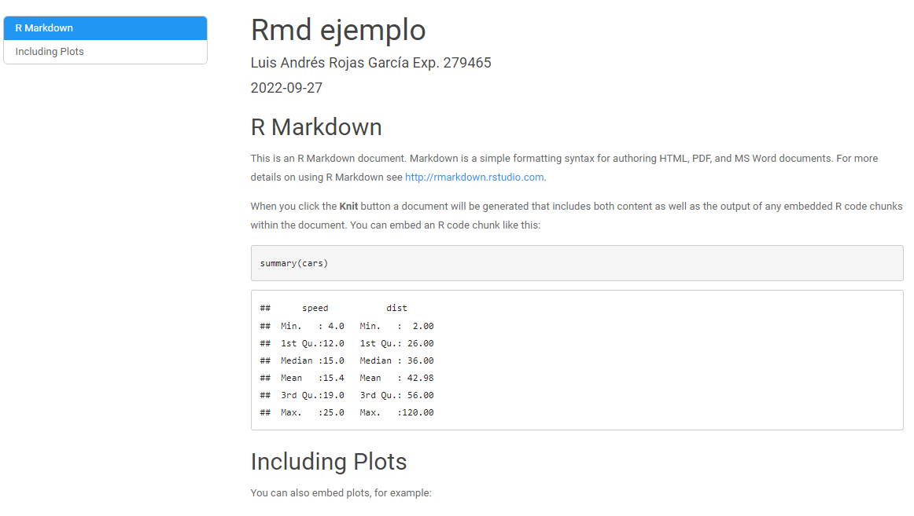
<br>
<br>

## readable

```
---
title: "Rmd ejemplo"
author: "Luis Andrés Rojas García Exp. 279465"
date: "2022-09-27"
output:
  html_document:
    theme: readable
    toc: yes
    toc_float:
      collapsed: no
      smooth_scroll: yes
---
```

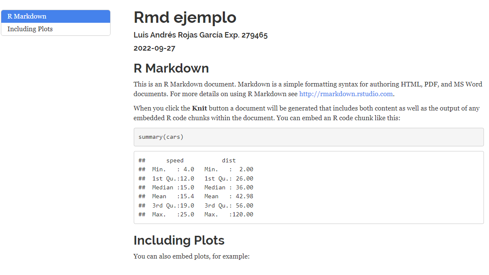
<br>
<br>

## sandstone

```
---
title: "Rmd ejemplo"
author: "Luis Andrés Rojas García Exp. 279465"
date: "2022-09-27"
output:
  html_document:
    theme: sandstone
    toc: yes
    toc_float:
      collapsed: no
      smooth_scroll: yes
---
```

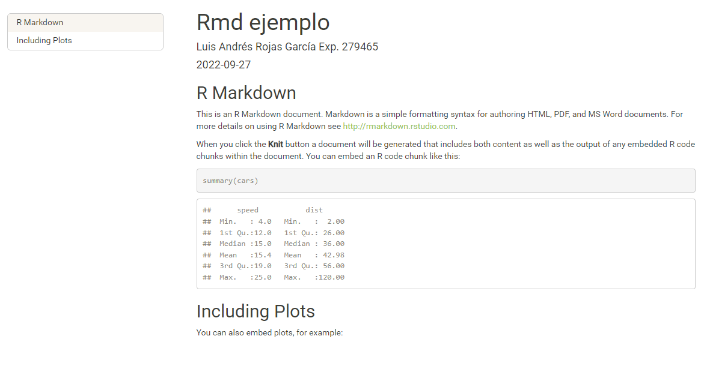
<br>
<br>

## simplex

```
---
title: "Rmd ejemplo"
author: "Luis Andrés Rojas García Exp. 279465"
date: "2022-09-27"
output:
  html_document:
    theme: simplex
    toc: yes
    toc_float:
      collapsed: no
      smooth_scroll: yes
---
```

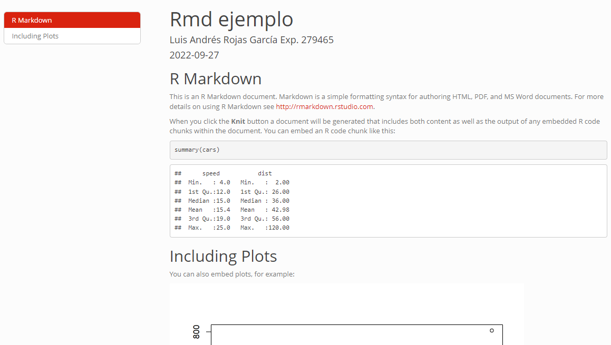
<br>
<br>

## spacelab

```
---
title: "Rmd ejemplo"
author: "Luis Andrés Rojas García Exp. 279465"
date: "2022-09-27"
output:
  html_document:
    theme: spacelab
    toc: yes
    toc_float:
      collapsed: no
      smooth_scroll: yes
---
```

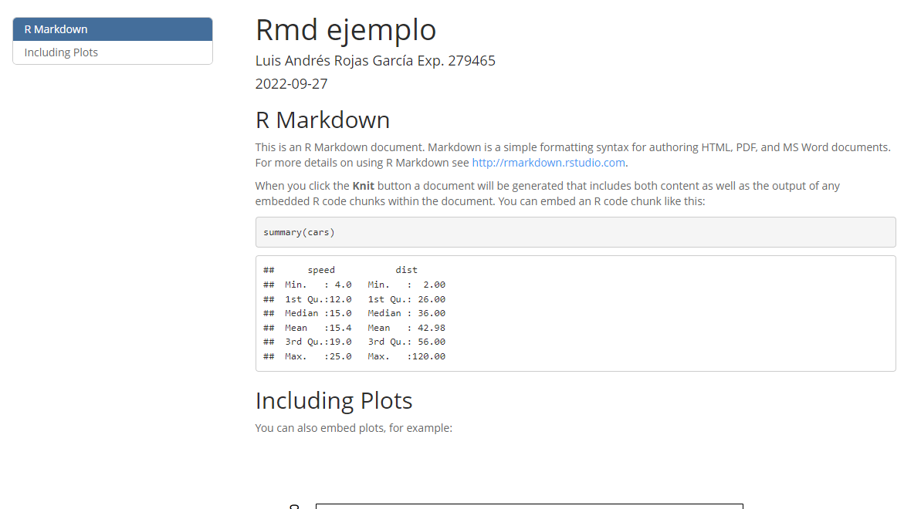
<br>
<br>

## united

```
---
title: "Rmd ejemplo"
author: "Luis Andrés Rojas García Exp. 279465"
date: "2022-09-27"
output:
  html_document:
    theme: united
    toc: yes
    toc_float:
      collapsed: no
      smooth_scroll: yes
---
```

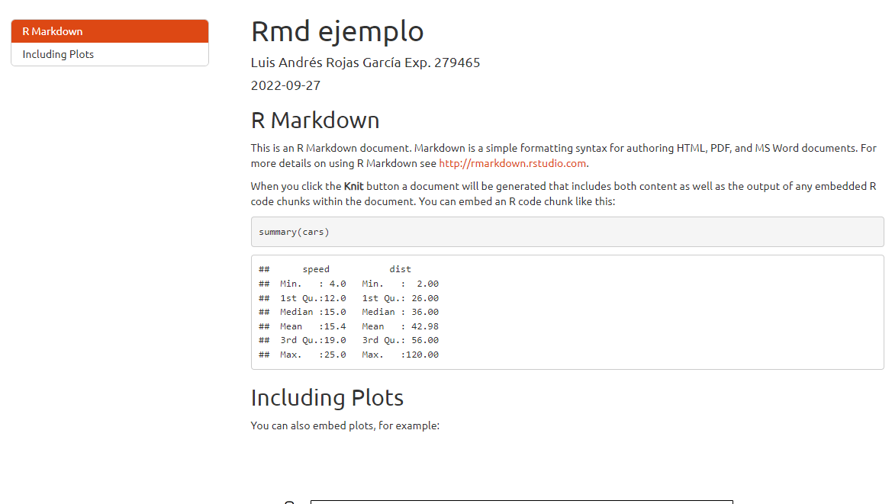
<br>
<br>

## yeti

```
---
title: "Rmd ejemplo"
author: "Luis Andrés Rojas García Exp. 279465"
date: "2022-09-27"
output:
  html_document:
    theme: yeti
    toc: yes
    toc_float:
      collapsed: no
      smooth_scroll: yes
---
```

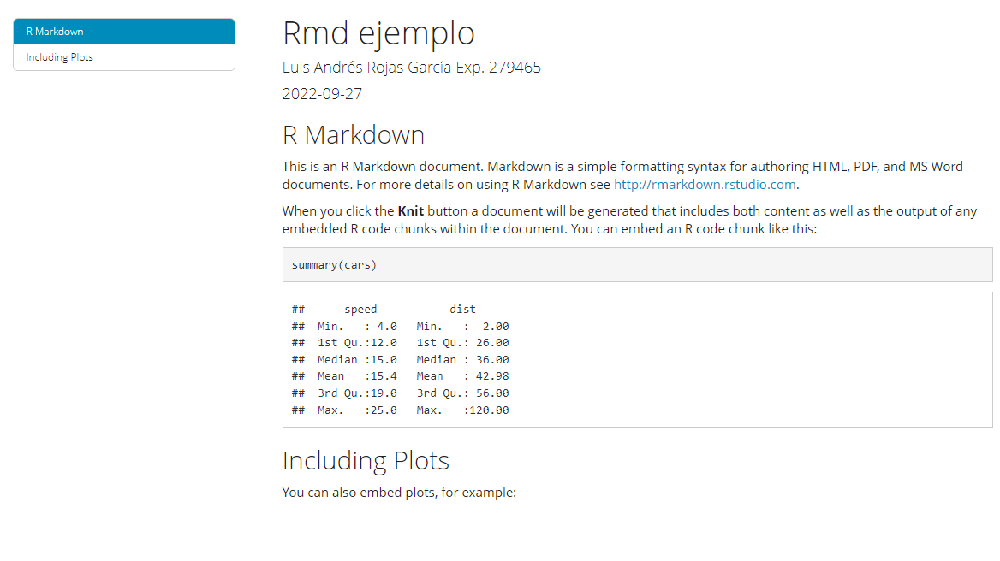
<br>
<br>

# Otros colores

Si quieres que tu Rmarkdown sea más personalizado, tenga más estilo o un mejor diseño, puedes aplicar otros temas que vienen incluidos en algunos paquetes. Para ello, debes tener instalado el paquete del cual quieres aplicar el tema. 

## ipsum

El paquete para este tema es *hrbrthemes*

```
install.packages("hrbrthemes")
```

```
---
title: "Rmd ejemplo"
author: "Luis Andrés Rojas García Exp. 279465"
date: "2022-09-27"
output: 
  hrbrthemes::ipsum:
    toc: yes
    toc_float:
      collapsed: no
      smooth_scroll: yes
---
```

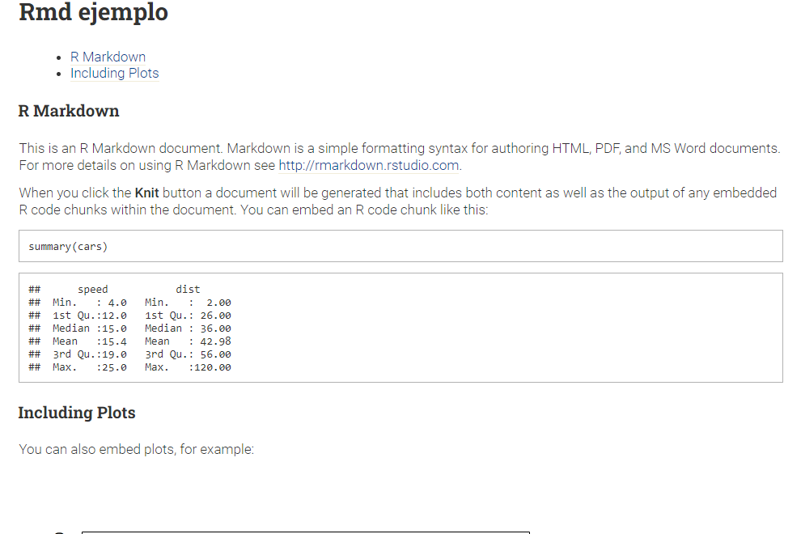
<br>
<br>

## architect

El paquete para este tema es *prettydoc*

```
install.packages("prettydoc")
```

```
---
title: "Rmd ejemplo"
author: "Luis Andrés Rojas García Exp. 279465"
date: "2022-09-27"
output: 
  prettydoc::html_pretty:
    theme: architect
    toc: yes
---
```

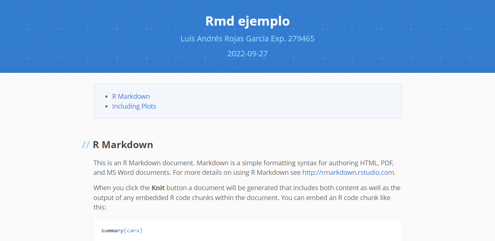
<br>
<br>

## cayman

El paquete para este tema es *prettydoc*

```
install.packages("prettydoc")
```

```
---
title: "Rmd ejemplo"
author: "Luis Andrés Rojas García Exp. 279465"
date: "2022-09-27"
output: 
  prettydoc::html_pretty:
    theme: cayman
    toc: yes
---
```

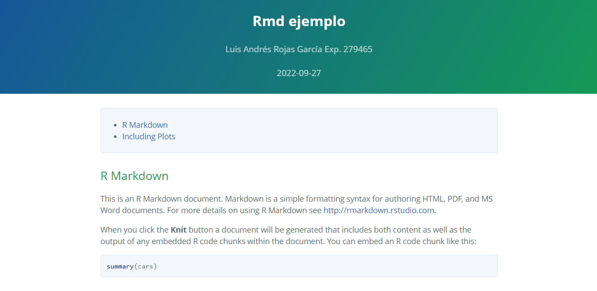
<br>
<br>

## hpstr


El paquete para este tema es *prettydoc*

```
install.packages("prettydoc")
```

```
---
title: "Rmd ejemplo"
author: "Luis Andrés Rojas García Exp. 279465"
date: "2022-09-27"
output: 
  prettydoc::html_pretty:
    theme: hpstr
    toc: yes
---
```

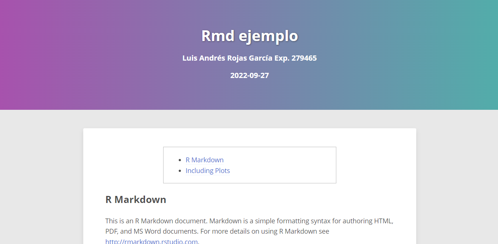
<br>
<br>

## leonids


El paquete para este tema es *prettydoc*

```
install.packages("prettydoc")
```

```
---
title: "Rmd ejemplo"
author: "Luis Andrés Rojas García Exp. 279465"
date: "2022-09-27"
output: 
  prettydoc::html_pretty:
    theme: leonids
    toc: yes
---
```

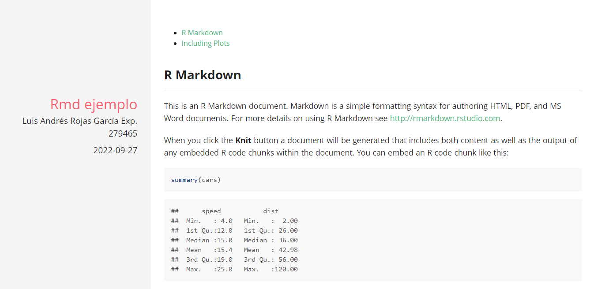
<br>
<br>

## tactile


El paquete para este tema es *prettydoc*

```
install.packages("prettydoc")
```

```
---
title: "Rmd ejemplo"
author: "Luis Andrés Rojas García Exp. 279465"
date: "2022-09-27"
output: 
  prettydoc::html_pretty:
    theme: tactile
    toc: yes
---
```

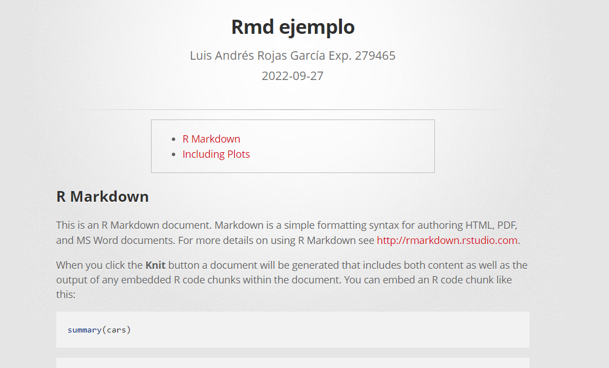
<br>
<br>

## html_clean


El paquete para este tema es *rmdformats*

```
install.packages("rmdformats")
```

```
---
title: "Rmd ejemplo"
author: "Luis Andrés Rojas García Exp. 279465"
date: "2022-09-27"
output: rmdformats::html_clean 
---
```

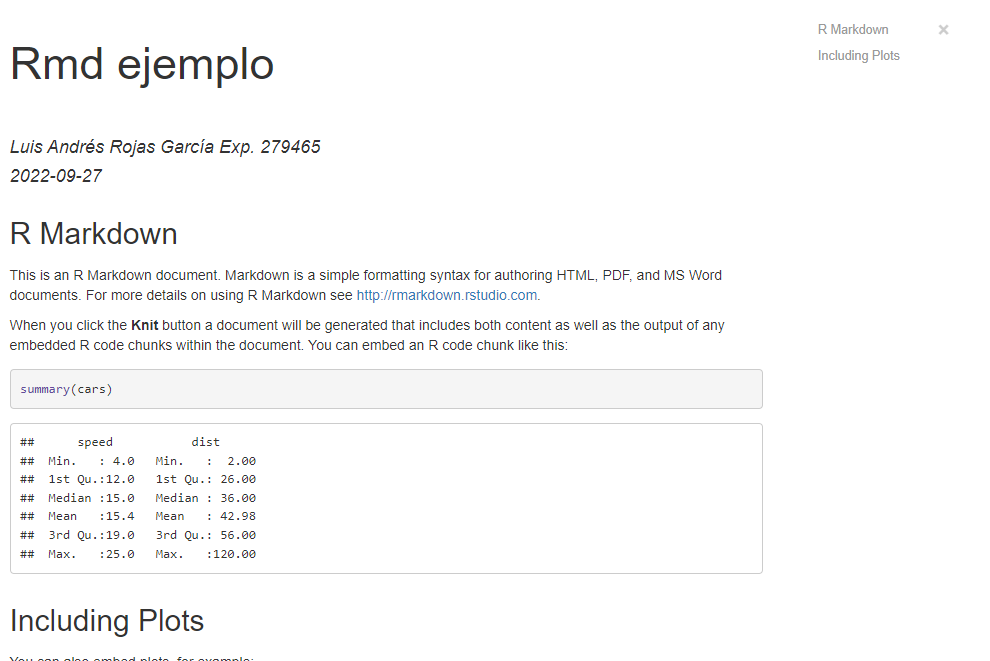
<br>
<br>

## html_docco


El paquete para este tema es *rmdformats*

```
install.packages("rmdformats")
```

```
---
title: "Rmd ejemplo"
author: "Luis Andrés Rojas García Exp. 279465"
date: "2022-09-27"
output: rmdformats::html_docco 
---
```

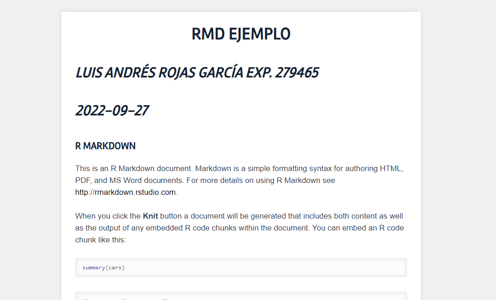
<br>
<br>

## readthedown


El paquete para este tema es *rmdformats*

```
install.packages("rmdformats")
```

```
---
title: "Rmd ejemplo"
author: "Luis Andrés Rojas García Exp. 279465"
date: "2022-09-27"
output: rmdformats::readthedown 
---
```

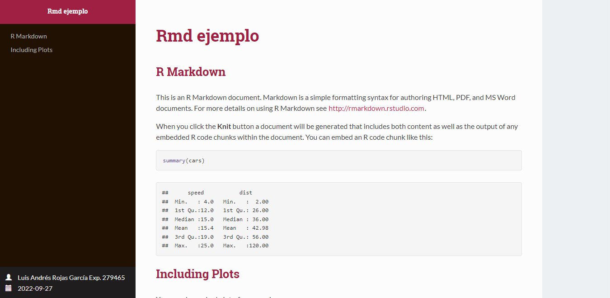
<br>
<br>

## material


El paquete para este tema es *rmdformats*

```
install.packages("rmdformats")
```

```
---
title: "Rmd ejemplo"
author: "Luis Andrés Rojas García Exp. 279465"
date: "2022-09-27"
output: rmdformats::material
---
```

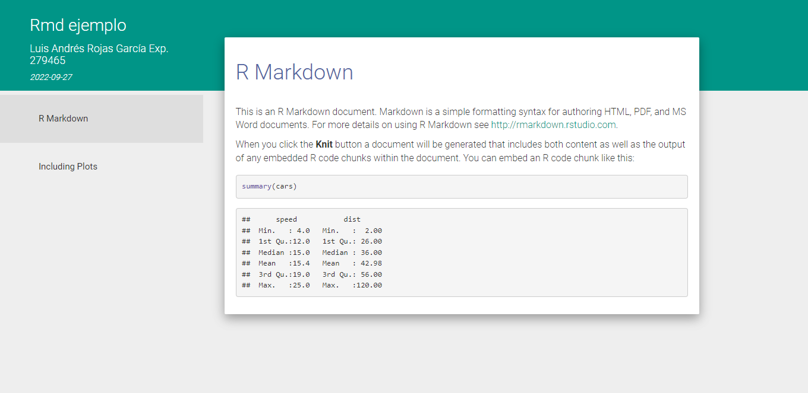
<br>
<br>

## robobook


El paquete para este tema es *rmdformats*

```
install.packages("rmdformats")
```

```
---
title: "Rmd ejemplo"
author: "Luis Andrés Rojas García Exp. 279465"
date: "2022-09-27"
output: rmdformats::robobook
---
```

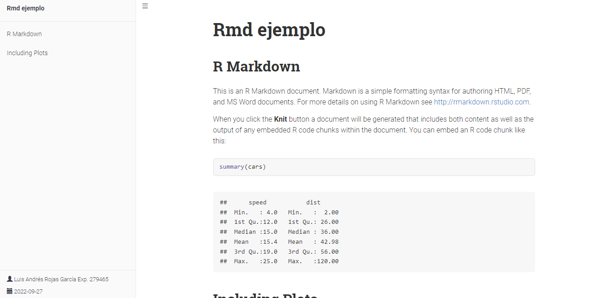
<br>
<br>

## downcute


El paquete para este tema es *rmdformats*

```
install.packages("rmdformats")
```

```
---
title: "Rmd ejemplo"
author: "Luis Andrés Rojas García Exp. 279465"
date: "2022-09-27"
output: rmdformats::downcute
---
```

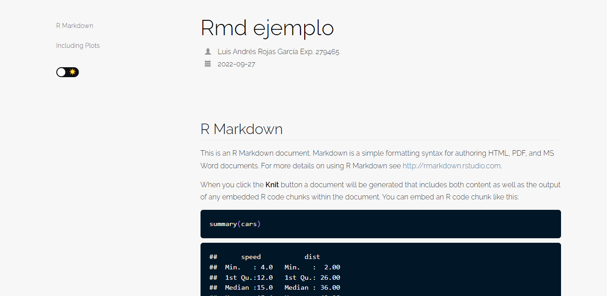
<br>
<br>

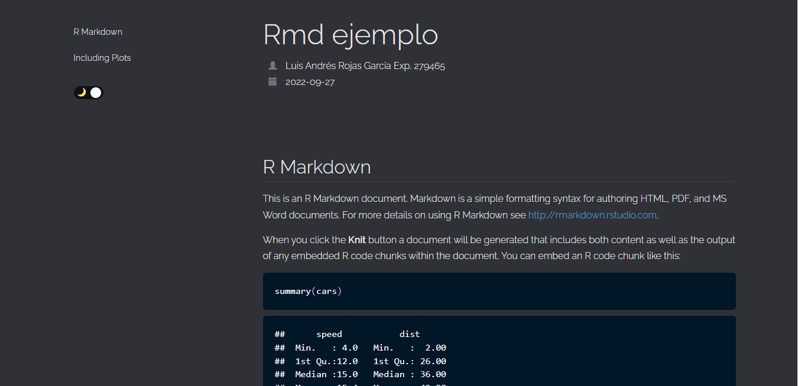
<br>
<br>

## tint


El paquete para este tema es *tint*

```
install.packages("tint")
```

```
---
title: "Rmd ejemplo"
author: "Luis Andrés Rojas García Exp. 279465"
date: "2022-09-27"
output: tint::tintHtml
---
```

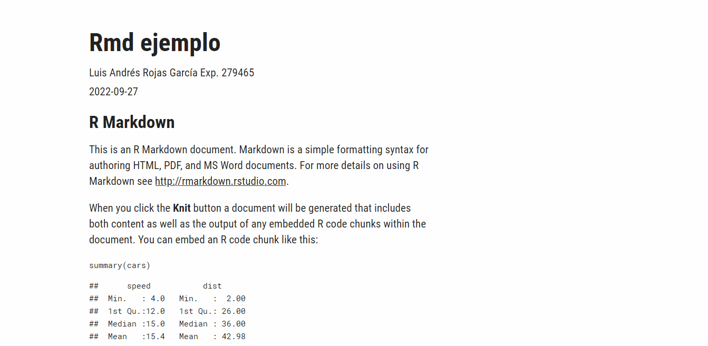
<br>
<br>

## tufte_html


El paquete para este tema es *tufte*

```
install.packages("tufte")
```

```
---
title: "Rmd ejemplo"
author: "Luis Andrés Rojas García Exp. 279465"
date: "2022-09-27"
output: tufte::tufte_html
---
```

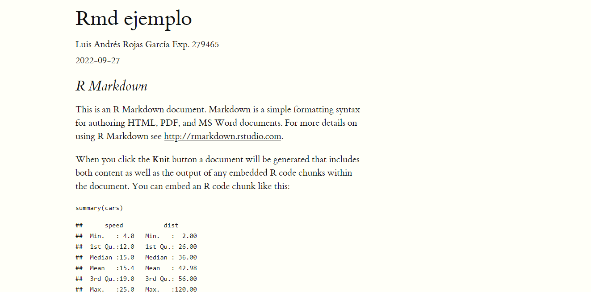
<br>
<br>
